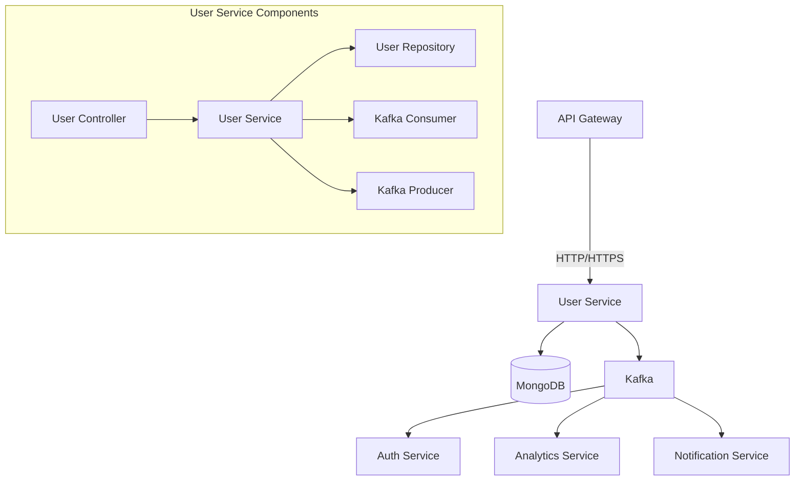

# User Service

User Service is a microservice responsible for managing user profiles, preferences, and related operations in the Fitness Application ecosystem.

## 📊 Service Architecture



## 🛠️ Requirements

- Node.js 18+
- npm 9+
- MongoDB 6.0+
- Kafka 3.0+
- Redis (for caching)

## 📦 Installation

1. **Clone the repository** (if not already cloned)
   ```bash
   git clone https://github.com/yourusername/fitness-app.git
   cd fitness-app/services/user-service
   ```

2. **Install dependencies**
   ```bash
   npm install
   ```

3. **Environment Configuration**
   ```bash
   cp .env.example .env
   # Update the .env file with your configuration
   ```

4. **Start the service**
   ```bash
   # Development
   npm run dev
   
   # Production
   npm run build
   npm start
   ```

## 🔧 Environment Variables

```env
# Server Configuration
PORT=3001
NODE_ENV=development

# Database
MONGODB_URI=mongodb://localhost:27017/fitness_users

# Kafka
KAFKA_BROKERS=localhost:9092
KAFKA_GROUP_ID=user-service-group

# Redis
REDIS_HOST=localhost
REDIS_PORT=6379

# JWT (for token validation)
JWT_SECRET=your_jwt_secret
```

## 🚀 API Endpoints

### User Management
- `POST /api/users` - Create a new user
- `GET /api/users/:id` - Get user by ID
- `PUT /api/users/:id` - Update user
- `DELETE /api/users/:id` - Delete user
- `GET /api/users/me` - Get current user profile

### Preferences
- `GET /api/users/:id/preferences` - Get user preferences
- `PUT /api/users/:id/preferences` - Update user preferences

## 🔄 Event Consumption

Consumes events from:
- `user.created` - When a new user is created in Auth Service
- `user.updated` - When user details are updated
- `user.deleted` - When a user is deleted

## 📡 Event Publishing

Publishes events to:
- `profile.updated` - When user profile is updated
- `preferences.updated` - When user preferences are changed

## 🧪 Testing

```bash
# Run unit tests
npm test

# Run integration tests
npm run test:integration

# Run tests with coverage
npm run test:coverage
```

## 🚀 Deployment

### Docker
```bash
docker build -t fitness-user-service .
docker run -p 3001:3001 --env-file .env fitness-user-service
```

### Kubernetes
Example deployment configuration:
```yaml
apiVersion: apps/v1
kind: Deployment
metadata:
  name: user-service
spec:
  replicas: 3
  selector:
    matchLabels:
      app: user-service
  template:
    metadata:
      labels:
        app: user-service
    spec:
      containers:
      - name: user-service
        image: fitness-user-service:latest
        ports:
        - containerPort: 3001
        envFrom:
        - secretRef:
            name: user-service-env
---
apiVersion: v1
kind: Service
metadata:
  name: user-service
spec:
  selector:
    app: user-service
  ports:
  - protocol: TCP
    port: 80
    targetPort: 3001
```

## 📚 Documentation

- [API Documentation](https://api-docs.example.com/user-service)
- [Architecture Decision Records](./docs/adr/)
- [Changelog](./CHANGELOG.md)

## 🤝 Contributing

1. Fork the repository
2. Create your feature branch (`git checkout -b feature/AmazingFeature`)
3. Commit your changes (`git commit -m 'Add some AmazingFeature'`)
4. Push to the branch (`git push origin feature/AmazingFeature`)
5. Open a Pull Request

## 📄 License

This project is licensed under the MIT License - see the [LICENSE](LICENSE) file for details.
